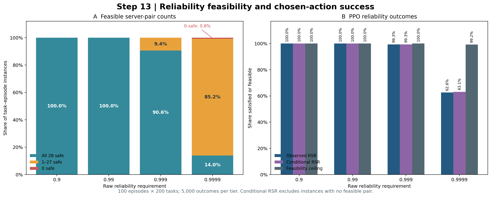
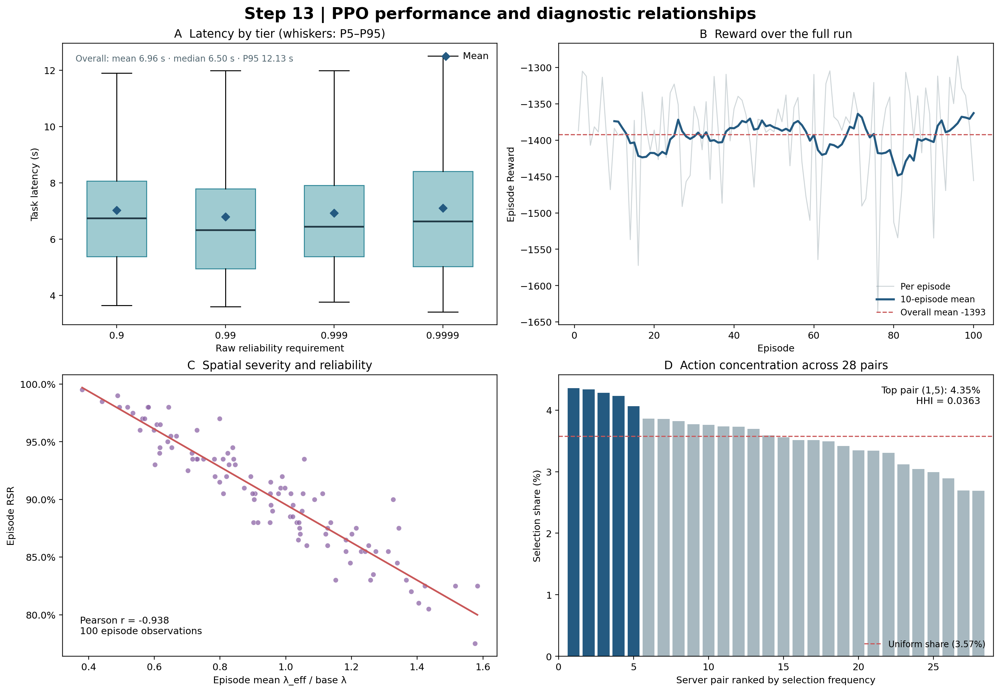
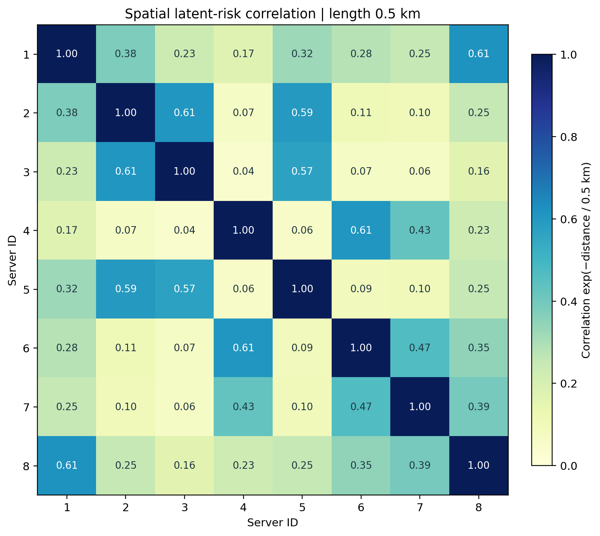

# Step 13: four-tier reliability and spatial PPO diagnostic

## Configuration and provenance

- Run: temporary verification harness calling `Project_main.build_model()` and `MainLoop.EP()`, 100 episodes × 200 tasks, unconstrained PPO, 8 servers, 43-dimensional observation.
- Raw reliability requirements: `(0.9, 0.99, 0.999, 0.9999)`; exactly 50 tasks per tier in the frozen task profile and 5,000 outcomes per tier.
- Observation reliability encoding: `0.9 → 0`, `0.99 → 1/3`, `0.999 → 2/3`, `0.9999 → 1`. Feasibility, RSR, and margin use raw requirements.
- Spatial correlation length: 0.5 km. **SPATIAL_RISK_BETA_P = 0.5 is a temporary exploratory value.** It is not a literature-calibrated final parameter.
- One latent physical risk field is sampled per episode using `MASTER_SEED = 2026`. It modulates effective failure intensities; pair reliability retains the independent-replica formula. For this cleanup verification, Python random, NumPy global RNG and PyTorch are also seeded to 2026; PyTorch CPU uses one thread. The permanent configuration is unchanged.
- TaskResults retains its 20-column schema. Chosen-pair reliability snapshots agree with the independently reconstructed episode fields for all 20,000 outcomes.

## Spatial topology

Off-diagonal correlation (min / median / max): **0.0400862 / 0.250854 / 0.614933**.

Distance matrix in km, rows and columns Server_ID 1..8:

```
0.000000 0.487050 0.727540 0.880859 0.564484 0.639896 0.689171 0.243121
0.487050 0.000000 0.250241 1.365259 0.259769 1.120296 1.157975 0.689833
0.727540 0.250241 0.000000 1.608361 0.282087 1.365625 1.377075 0.909971
0.880859 1.365259 1.608361 0.000000 1.424644 0.250129 0.422548 0.741120
0.564484 0.259769 0.282087 1.424644 0.000000 1.194412 1.146953 0.693058
0.639896 1.120296 1.365625 0.250129 1.194412 0.000000 0.381414 0.531511
0.689171 1.157975 1.377075 0.422548 1.146953 0.381414 0.000000 0.468546
0.243121 0.689833 0.909971 0.741120 0.693058 0.531511 0.468546 0.000000
```

Spatial correlation matrix, rows and columns Server_ID 1..8:

```
1.000000 0.377532 0.233382 0.171750 0.323367 0.278095 0.251996 0.614933
0.377532 1.000000 0.606239 0.065186 0.594795 0.106396 0.098672 0.251663
0.233382 0.606239 1.000000 0.040086 0.568830 0.065138 0.063663 0.162035
0.171750 0.065186 0.040086 1.000000 0.057886 0.606374 0.429516 0.227128
0.323367 0.594795 0.568830 0.057886 1.000000 0.091738 0.100872 0.250045
0.278095 0.106396 0.065138 0.606374 0.091738 1.000000 0.466345 0.345410
0.251996 0.098672 0.063663 0.429516 0.100872 0.466345 1.000000 0.391766
0.614933 0.251663 0.162035 0.227128 0.250045 0.345410 0.391766 1.000000
```

Across all episode × server values, `lambda_eff/base_lambda` (min / median / mean / P5 / P95 / max): **0.146266 / 0.838109 / 0.943531 / 0.343433 / 1.85454 / 4.21255**. Effective failure intensity (min / median / max, s⁻¹): **0.000218946 / 0.00188989 / 0.0113571**.

## Episode-specific feasibility

The audit evaluates all 560,000 task–episode–pair combinations using each episode's effective failure rates. `Partial_Safe` means 1–27 safe actions. The feasibility ceiling is the fraction with at least one safe action.

| Tier | Samples | Zero_Safe | Zero_Safe_Rate | Partial_Safe | Partial_Safe_Rate | All_28_Safe | All_28_Safe_Rate | Safe_Count_Min | Safe_Count_Median | Safe_Count_Mean | Safe_Count_Max | Feasibility_Ceiling |
| --- | --- | --- | --- | --- | --- | --- | --- | --- | --- | --- | --- | --- |
| Overall | 20000 | 40 | 0.002 | 4731 | 0.23655 | 15229 | 0.76145 | 0 | 28 | 25.3183 | 28 | 0.998 |
| 0.9 | 5000 | 0 | 0 | 0 | 0 | 5000 | 1 | 28 | 28 | 28 | 28 | 1 |
| 0.99 | 5000 | 0 | 0 | 0 | 0 | 5000 | 1 | 28 | 28 | 28 | 28 | 1 |
| 0.999 | 5000 | 0 | 0 | 469 | 0.0938 | 4531 | 0.9062 | 17 | 28 | 27.8082 | 28 | 1 |
| 0.9999 | 5000 | 40 | 0.008 | 4262 | 0.8524 | 698 | 0.1396 | 0 | 18 | 17.465 | 28 | 0.992 |

## Observed reliability and latency

RSR is the fraction of chosen actions satisfying the raw requirement. Conditional RSR excludes instances with no safe action.

| Tier | Outcomes | Satisfied | RSR | Conditional_RSR | Feasibility_Ceiling |
| --- | --- | --- | --- | --- | --- |
| Overall | 20000 | 18094 | 0.9047 | 0.906513 | 0.998 |
| 0.9 | 5000 | 5000 | 1 | 1 | 1 |
| 0.99 | 5000 | 5000 | 1 | 1 | 1 |
| 0.999 | 5000 | 4964 | 0.9928 | 0.9928 | 1 |
| 0.9999 | 5000 | 3130 | 0.626 | 0.631048 | 0.992 |

Task latency in seconds:

| Tier | Mean_s | Median_s | P95_s |
| --- | --- | --- | --- |
| Overall | 6.96276 | 6.49607 | 12.1327 |
| 0.9 | 7.02473 | 6.73843 | 11.9026 |
| 0.99 | 6.79803 | 6.32362 | 11.9917 |
| 0.999 | 6.92827 | 6.43727 | 11.9828 |
| 0.9999 | 7.10001 | 6.6316 | 12.5043 |

Chosen-pair reliability margin (`pair_reliability - raw_requirement`):

| Tier | Mean | Median | P5 | Min |
| --- | --- | --- | --- | --- |
| Overall | 0.0276469 | 0.00433014 | -9.7589e-05 | -0.00253131 |
| 0.9 | 0.0998697 | 0.099931 | 0.0995475 | 0.0978845 |
| 0.99 | 0.00987601 | 0.00993879 | 0.00956062 | 0.00766054 |
| 0.999 | 0.000876201 | 0.000936989 | 0.000584791 | -0.00179704 |
| 0.9999 | -3.45523e-05 | 3.27073e-05 | -0.00038896 | -0.00253131 |

## Reward and action concentration

Episode Reward (mean / last / best / worst): **-1392.55 / -1455.63 / -1284.21 / -1636.24**. Reward remains `-task_latency`; the Logs sheet retains `task_Avg_Delay`.

Pair HHI: **0.0362928**. Most selected pair: **(1,5)**, 871 selections (0.04355 share). Top five pairs:

| Pair | Selections | Share |
| --- | --- | --- |
| (1,5) | 871 | 0.04355 |
| (6,8) | 867 | 0.04335 |
| (2,4) | 856 | 0.0428 |
| (4,5) | 846 | 0.0423 |
| (1,3) | 813 | 0.04065 |

Most selected pair by reliability tier:

| Tier | Most_Selected_Pair | Selections | Share |
| --- | --- | --- | --- |
| 0.9 | (6,8) | 214 | 0.0428 |
| 0.99 | (4,5) | 224 | 0.0448 |
| 0.999 | (1,5) | 231 | 0.0462 |
| 0.9999 | (1,5) | 226 | 0.0452 |

## Spatial severity and episode outcomes

Correlations use 100 episode-level observations and are descriptive. Severity is the episode mean `lambda_eff/base_lambda`.

| Severity_vs | Pearson | Spearman |
| --- | --- | --- |
| Zero_Safe_Rate | 0.403902 | 0.42513 |
| Partial_Safe_Rate | 0.824502 | 0.824288 |
| RSR | -0.937767 | -0.938367 |
| task_Avg_Delay | -0.124118 | -0.13919 |

Supporting CSVs contain the 100 reconstructed spatial fields and effective rates, episode/tier feasibility, and all 28 pair selection counts.

## Figures






