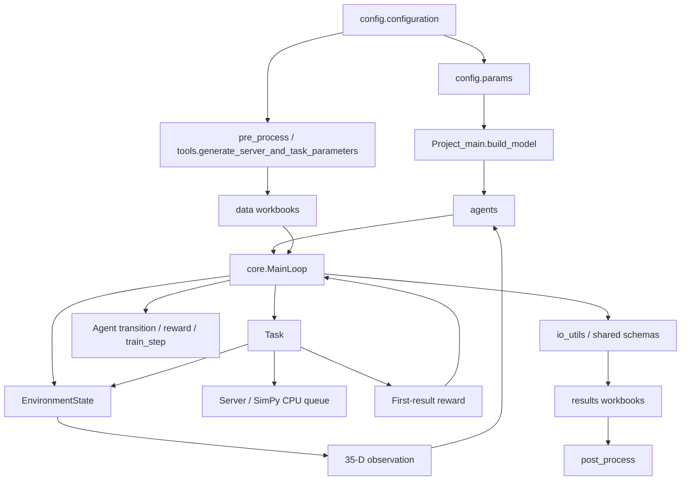

# 代码关系与清理记录

审查日期：2026-09-28。按入口、`agents/`、`config/`、`core/`、
`diagnostics/`、`io_utils/`、测试、`tools/` 的顺序梳理，最后复查差异。

## 范围

工作区共 150 个 Python 文件，包括本次新增的两个共用模块及 4 个原本
未跟踪的实验/测试脚本。全部完成语法解析、定义/导入关系与常见结构问题
检查；对网络构建、仿真调度、奖励归属、日志持久化和本次修改点做了重点
人工复核。下方清单区分“修改”和“保留”，不表示每个历史实验都重新运行。

保留已有 `.gitignore`、结果工作簿、训练权重、诊断数据和未提交实验工作。
数据集及结果目录不是源码，不做删除或重新生成。没有启动正式多种子训练，
没有改写已有研究结果。测试通过不等同于对所有研究结论作数学正确性证明。

## 主链路

`diagnostics/` 和 `tools/` 在这条链路外围安排种子、训练/冻结评估、插桩、
反事实重放、统计与报告。两个目录之间已有相互依赖，因此不能仅按文件名
把某个 runner 或“未使用”的导入当成独立无副作用代码删除。

## 必须保留的语义

| 边界 | 当前行为 |
| --- | --- |
| 配置 | `parameters` 为默认配置；`params` 是导入时的可独立修改快照 |
| 动作 | 8 个 Edge 节点的 28 个无序异节点对，固定 combinations 顺序 |
| 状态 | 4 个节点特征块 + 3 个任务特征，共 35 维；CPU backlog 不含上传中的副本 |
| 风险 | episode 空间场改变有效故障率；状态输入仍使用基础故障率 |
| 成功判定 | 解析 pair reliability 与任务阈值比较；执行过程没有独立 Bernoulli 故障抽样 |
| 生命周期 | 首副本结果触发任务 resolution；两个副本都完成且奖励记账后才删除任务 |
| 原始 PPO | 到达顺序存 transition；resolved reward 回填原任务，episode 末更新 |
| v2 PPO | 默认事件区间奖励、区间内折扣、context actor、独立梯度裁剪；属于有意的版本差异 |
| 辅助学习器 | Q / centered advantage 有独立参数和随机数边界，不接管 PPO 的策略与价值损失 |
| 日志 | 原始任务行 32 列；Excel 插入 `Final_status`，保留历史前缀与兼容字段 |
| 历史诊断 | 单次共享随机流的反事实对照不是期望 Q 的统计估计，不能自动替代因果证据 |

## 已完成的清理

1. **入口和说明**：去掉旧模板文件名、迁移过程说明、注释掉的调试输出和失效
   配置备选值；README 更新到实际状态维度、故障模型、奖励语义及 agent 接口。
2. **agents**：把 DQN、PPO actor/value/pair scorer 的隐藏层构建集中到
   `agents/networks.py`。不改层名、层顺序、初始化顺序和 checkpoint 布局。
   Q 网络去掉只调用父类的 `forward` 及未使用的数组转换。
3. **core**：把 PPO 与 DQN/DDPG 两份等价的任务日志拼装提取为
   `MainLoop._record_task_assignment`，调用仍处于原位置；整理副本执行中的
   局部变量命名和注释。未合并初始化/重置，也未改动 SimPy 调度流程。
4. **diagnostics**：删除 `async_task_credit_audit.py` 中被后续同名定义覆盖的
   `_make_plots`、`_md_table`、`_write_report`、`run`，共 286 行。保留最后实际
   生效的实现。三个 value/state audit 模块改为显式导入；counterfactual
   runner 删除重复导入同一个符号的语句。
5. **io_utils**：增加轻量的 `schemas.py`，集中定义任务日志字段；原
   `tools.pair_policy_diagnostics.TASK_ASSIGNMENT_COLUMNS` 继续再导出该常量。
   Excel 导出取列表副本，保持每次调用的本地字段列表。
6. **tests/tools**：移除测试中确认未引用的导入；去掉工具导入列表中的未用
   符号；复用条件可靠性工具中完全相同的正整数校验函数。

## 验证

- 清理前：399 tests、90 subtests 通过。
- 网络等价性：5 种网络 × 3 种激活 × 2 组隐藏层配置，共 30 组，与 Git HEAD
  对照，checkpoint 键、初始参数、随机数状态和 forward 输出逐位一致。
- 主循环等价性：DQN、DDPG、PPO 各运行 2 episodes × 12 tasks；任务、
  副本、空间风险、episode 日志和训练后网络权重均与原主循环逐位一致。
- 删除死代码：移除被覆盖定义后的旧文件 AST 与新文件 AST 完全一致。
- 显式导入：在内存执行拟议模块，48 个原隐式全局依赖逐个验证为同一对象。
- 最终完整测试：399 tests、90 subtests 通过；一处已有的张量构造性能告警。
- 150 个 Python 文件均完成语法解析和内存编译；`git diff --check` 通过。
- Pyflakes 尚有 88 条提示：53 个未用导入、33 个未用局部变量及 2 个
  无插值占位符的 f-string；没有未定义名称、通配符导入或同名定义覆盖。

## 保留项与限制

- 环境初始化/重置合并、批量删除诊断导入曾被自动审批拒绝，理由分别是
  生命周期风险和无法仅由静态检查排除导入/再导出副作用。这两项未执行。
  已完成的共用函数提取和显式导入替换都有独立等价性证据。
- 部分 Pyflakes 提示仍存在，包括兼容再导出和历史报告里未引用的局部变量。
  尤其不能直接删除 `x = run_or_read(...)`：右侧可能仍执行实验、写文件或校验输入。
- PPO 版本之间的 GAE、梯度裁剪和错误处理存在刻意差异；未为了减少行数把它们
  合并成同一套训练分支。历史输出字段、兼容别名和测试 fixture 也按原约定保留。
- 一些历史 audit 把源码 SHA256 作为重放前置条件。此次源码清理会改变这些
  哈希；复现原实验应使用其记录的原 commit，不能更新旧 manifest 来绕过检查。
- 大型报告/实验函数仍可进一步分解，但这需要逐阶段的输出对照；本轮没有
  运行数百 episode 的正式训练或重算所有反事实分支。

## 按目录排列的源码范围

已枚举的 Python 源码按目录如下；其中包括工作区原有的未跟踪实验脚本。
这项统计来自最后一轮按路径扫描，不包含数据集、结果文件或缓存。

| 目录 | Python 文件数 | 主要关系和本轮处理 |
| --- | ---: | --- |
| 根目录 | 3 | 入口与前后处理包装；更新入口说明和 README |
| `agents/` | 10 | 依赖 `config/`、部分调用 `core.Task`；共用隐藏层构造 |
| `config/` | 6 | 定义实验默认值、运行参数与路径；去掉过时注释 |
| `core/` | 6 | 调度、环境、任务、服务器、空间风险；提取等价日志块 |
| `diagnostics/` | 39 | 引用核心、智能体和工具进行实验；移除被覆盖代码及通配符依赖 |
| `io_utils/` | 4 | 导出和处理 Excel；集中日志字段定义 |
| `tests/` | 57 | 覆盖各层行为；清除确认未引用的测试导入 |
| `tools/` | 25 | 数据准备、离线分析与实验入口；复用相同的输入校验函数 |

本次复查已读取最终测试日志，并重新核对差异、语法与共用字段顺序。
上次的自动审批额度错误已解除；环境重置合并和诊断导入的批量删除仍保留
原实现，等待有针对性的行为对照后再考虑修改。
